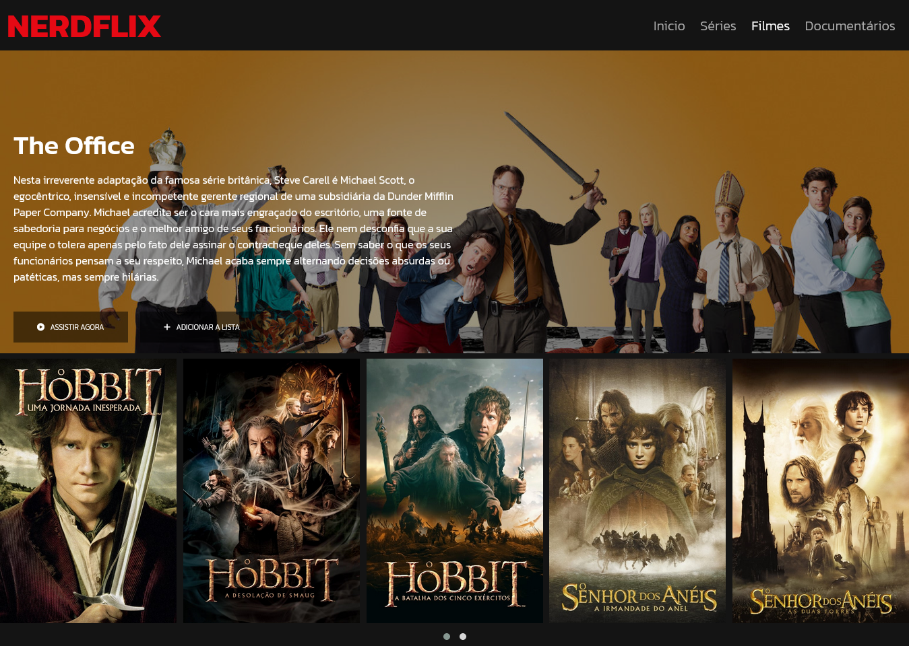
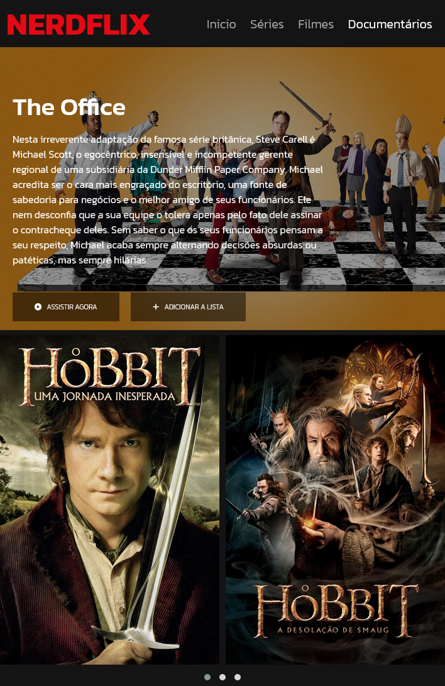
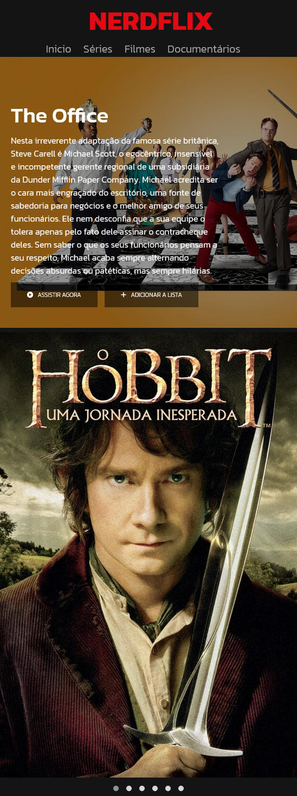

# Clone Netflix DIO

Clone da Netflix desenvolvida no Bootcamp HTML Web Developer disponível pela [Digital Inovation One](https://www.dio.me/). Aplicando conceitos de responsividade em diversos dispositivos.

[Site Do Projeto](https://martvie.github.io/clone-netflix-DIO/)

## imagens do projeto

## Tecnologias utilizadas

* HTML
* CSS
* JavaScript